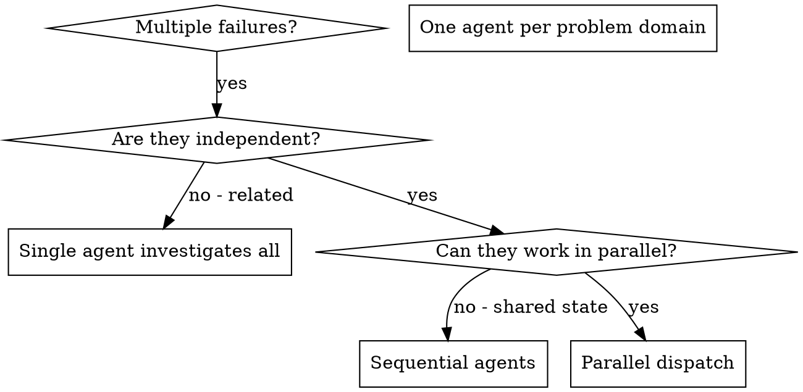

---
name: dispatching-parallel-agents
description: Use when facing 2+ independent tasks that can be worked on without shared state or sequential dependencies
---

# Dispatching Parallel Agents

## Overview


In Cline, use this skill for parallel read-only research and discovery, not for code-writing execution.
You delegate tasks to specialized agents with isolated context. By precisely crafting their instructions and context, you ensure they stay focused and succeed at their task. They should never inherit your session's context or history — you construct exactly what they need. This also preserves your own context for coordination work.

When you have multiple unrelated failures (different test files, different subsystems, different bugs), investigating them sequentially wastes time. Each investigation is independent and can happen in parallel.

**Core principle:** Dispatch one agent per independent problem domain. Let them work concurrently.

**Architecture note:** Keep parallel-agent decomposition as a stable design pattern. Current execution is read-only research dispatch. If future Cline capabilities add write-capable subagents, reuse the same decomposition boundaries with explicit ownership and controller-enforced review gates.

## When to Use



**Use when:**
- 3+ test files failing with different root causes
- Multiple subsystems broken independently
- Each problem can be understood without context from others
- No shared state between investigations

**Don't use when:**
- Failures are related (fix one might fix others)
- Need to understand full system state
- Agents would interfere with each other

## The Pattern

### 1. Identify Independent Domains

Group failures by what's broken:
- File A tests: Tool approval flow
- File B tests: Batch completion behavior
- File C tests: Abort functionality

Each domain is independent - investigating tool approval doesn't affect abort behavior tracing.

### 2. Create Focused Agent Tasks

Each agent gets:
- **Specific scope:** One test file or subsystem
- **Clear goal:** Produce evidence and root-cause hypotheses
- **Constraints:** Read-only research only
- **Expected output:** Summary of what you found, with concrete file paths and next implementation steps

### 3. Dispatch in Parallel

```text
// In Cline, dispatch parallel read-only research prompts via use_subagents
Subagent 1: "Investigate agent-tool-abort.test.ts failures and trace event timing assumptions"
Subagent 2: "Investigate batch-completion-behavior.test.ts failures and trace execution path"
Subagent 3: "Investigate tool-approval-race-conditions.test.ts and find race source"
// All three run concurrently; controller integrates and implements fixes locally
```

### 4. Review and Integrate

When agents return:
- Read each summary
- Verify fixes don't conflict
- Run full test suite
- Integrate all changes

## Agent Prompt Structure

Good agent prompts are:
1. **Focused** - One clear problem domain
2. **Self-contained** - All context needed to understand the problem
3. **Specific about output** - What should the agent return?

```markdown
Investigate the 3 failing tests in src/agents/agent-tool-abort.test.ts:

1. "should abort tool with partial output capture" - expects 'interrupted at' in message
2. "should handle mixed completed and aborted tools" - fast tool aborted instead of completed
3. "should properly track pendingToolCount" - expects 3 results but gets 0

These are timing/race condition issues. Your task:

1. Read the test file and understand what each test verifies
2. Identify root cause - timing issues or actual bugs?
3. Produce evidence-backed recommendations:
   - Where arbitrary timeouts should be replaced with condition-based waits
   - Which implementation paths likely contain abort/race bugs
   - Which tests may assert stale assumptions

Do NOT propose blind timeout increases. Find evidence.

Return: Summary of root cause hypotheses, evidence, and exact files the controller should edit.
```

## Common Mistakes

**❌ Too broad:** "Fix all the tests" - agent gets lost
**✅ Specific:** "Fix agent-tool-abort.test.ts" - focused scope

**❌ No context:** "Fix the race condition" - agent doesn't know where
**✅ Context:** Paste the error messages and test names

**❌ No constraints:** Agent might assume it should patch code
**✅ Constraints:** "Read-only investigation only. Recommend edits, do not implement."

**❌ Vague output:** "Fix it" - you don't know what changed
**✅ Specific:** "Return summary of root cause and changes"

## When NOT to Use

**Related failures:** Fixing one might fix others - investigate together first
**Need full context:** Understanding requires seeing entire system
**Exploratory debugging:** You don't know what's broken yet
**Shared state:** Agents would interfere (editing same files, using same resources)

## Real Example from Session

**Scenario:** 6 test failures across 3 files after major refactoring

**Failures:**
- agent-tool-abort.test.ts: 3 failures (timing issues)
- batch-completion-behavior.test.ts: 2 failures (tools not executing)
- tool-approval-race-conditions.test.ts: 1 failure (execution count = 0)

**Decision:** Independent domains - abort logic separate from batch completion separate from race conditions

**Dispatch:**
```
Agent 1 → Fix agent-tool-abort.test.ts
Agent 2 → Fix batch-completion-behavior.test.ts
Agent 3 → Fix tool-approval-race-conditions.test.ts
```

**Results:**
- Agent 1: Identified timeout assumptions and suggested condition-based waits
- Agent 2: Identified event structure mismatch (threadId nesting)
- Agent 3: Identified missing wait point before assertion

**Integration:** Controller implemented all recommended fixes, no conflicts, full suite green

**Time saved:** 3 problems solved in parallel vs sequentially

## Key Benefits

1. **Parallelization** - Multiple investigations happen simultaneously
2. **Focus** - Each agent has narrow scope, less context to track
3. **Independence** - Agents don't interfere with each other
4. **Speed** - 3 problems solved in time of 1

## Capability-Gated Evolution Path

- **Current mode:** read-only research subagents, controller-owned edits.
- **Future mode (only when explicitly enabled):** write-capable worker subagents with strict non-overlapping file ownership.
- **Invariant across modes:** independent domain decomposition, explicit integration checkpoints, and mandatory verification before completion claims.

## Verification

After agents return:
1. **Review each summary** - Understand what changed
2. **Check for conflicts** - Did agents edit same code?
3. **Run full suite** - Verify all fixes work together
4. **Spot check** - Agents can make systematic errors

## Real-World Impact

From debugging session (2025-10-03):
- 6 failures across 3 files
- 3 agents dispatched in parallel
- All investigations completed concurrently
- All fixes integrated successfully
- Zero conflicts between agent changes
