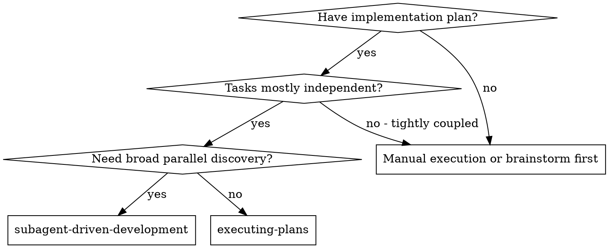
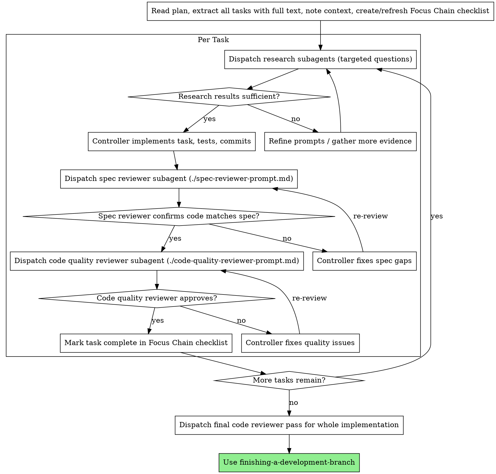

# Subagent-Driven Development

Execute plans with a controller pattern:
- main agent owns all file edits, tests, commits, and branch operations
- subagents run parallel read-only investigation and review passes
- every task passes two review gates: spec compliance first, then code quality

**Why this pattern in Cline:** subagents are high-throughput research workers with isolated context windows and read-only tooling. They can map the codebase quickly, surface risks, and review diffs without polluting the controller context.

**Core principle:** controller-owned implementation + parallel subagent research + two-stage review loops = high quality with strong context discipline.

## Cline Capability Constraints

Subagents in Cline are read-only research agents. They can:
- read/search files
- list code definitions
- run read-only commands
- use skills

They cannot:
- edit files or apply patches
- run browser tools or MCP tools
- spawn nested subagents

Design this workflow around those constraints. Never delegate code writing to subagents.

## Capability-Gated Multi-Agent Lanes

This skill preserves two orchestration lanes:

1. **Lane A (active now):** Controller-owned implementation + read-only subagents for research/review.
2. **Lane B (reserved for future):** Write-capable implementation subagents coordinated by a controller.

Activate Lane B only when BOTH are true:
- Cline officially exposes write-capable subagent tooling.
- Project governance (`CLINE.md` / `.clinerules/*`) explicitly enables it.

If either condition is false, remain on Lane A.

## When to Use



**vs. Executing Plans:**
- same-session execution, no context handoff
- parallel research briefs before each implementation step
- explicit review gates on every task
- stronger context hygiene on large codebases

## The Process



## Model Selection

Use the least powerful model that can handle each role:
- targeted file-location research: fast model
- cross-module tracing and integration mapping: standard model
- spec and quality review passes: strongest available model

**Complexity signals:**
- 1-2 files, clear interfaces -> fast model
- multi-file integration, lifecycle coupling -> standard model
- architectural risk, broad surface reviews -> strongest model

**Lane B reservation (future):**
- implementer subagents: standard/strong model
- review subagents: strongest model
- controller remains responsible for merge policy, branch hygiene, and final verification gates

## Handling Subagent Status

Research and review subagents should report one of four statuses:

**DONE:** proceed to next gate.

**DONE_WITH_CONCERNS:** continue, but convert concerns into explicit checks in the controller implementation or next review prompt.

**NEEDS_CONTEXT:** provide missing scope, paths, symbols, or assumptions; then re-dispatch.

**BLOCKED:** change something concrete before retry:
1. tighten or re-scope the question
2. provide better anchors (paths, symbols, commit range)
3. split the task into smaller investigation questions
4. escalate unresolved architectural ambiguity to the human

Never rerun the same blocked prompt unchanged.

## Prompt Templates

- `./implementer-prompt.md` - Controller implementation brief template (main agent uses this structure internally; not dispatched as a writing subagent)
- `./spec-reviewer-prompt.md` - Subagent spec compliance review prompt
- `./code-quality-reviewer-prompt.md` - Subagent code quality review prompt

## Example Workflow

```
You: I'm using Subagent-Driven Development to execute this plan.

[Read plan file once: docs/superpowers/plans/feature-plan.md]
[Extract all tasks with full text and context]
[Create/refresh Focus Chain checklist]

Task 1: Hook installation script

[Dispatch 2 research subagents]
  - Subagent A: locate existing hook bootstrap path conventions
  - Subagent B: find test harness patterns and fixtures

Research synthesis:
  - A found hook loading sequence in scripts/bootstrap/*
  - B found fixture factories in tests/helpers/hook-fixtures.ts

[Controller implements Task 1 locally]
[Controller runs tests and commits]

[Dispatch spec compliance reviewer]
Spec reviewer: ✅ Spec compliant

[Dispatch code quality reviewer]
Code reviewer: Important issue - missing rollback on partial install

[Controller fixes issue, reruns tests]
[Dispatch code quality reviewer again]
Code reviewer: ✅ Approved

[Mark Task 1 complete in Focus Chain]

Task 2: Recovery modes
...

[After all tasks]
[Dispatch final review pass]
[Use finishing-a-development-branch]
```

## Advantages

**vs. Manual execution:**
- parallel investigation without controller context bloat
- explicit evidence handoff before code edits
- deterministic quality gates every task

**vs. pure executing-plans:**
- higher discovery throughput on large codebases
- better separation between research and implementation
- review loops are structural, not ad hoc

**Quality gates:**
- review gate 1: spec compliance (build exactly what was requested)
- review gate 2: code quality (correctness, maintainability, risk)
- both must be green before task completion

## Red Flags

**Never:**
- start implementation on main/master without explicit user consent
- delegate file edits to subagents
- skip spec gate or quality gate
- start quality review before spec compliance is green
- move to next task while review issues remain open
- let review summaries replace direct code verification

**If a reviewer finds issues:**
- controller fixes
- rerun verification
- re-dispatch same reviewer
- repeat until approved

## Integration

**Required workflow skills:**
- **using-git-worktrees** - isolated workspace before implementation
- **writing-plans** - plan source of truth
- **requesting-code-review** - review rubric and categorization
- **finishing-a-development-branch** - structured completion options

**Controller execution skill:**
- **executing-plans** - used for concrete code editing/testing/commit steps

**Related capability skill:**
- **dispatching-parallel-agents** - reusable pattern for parallel subagent research briefs

## Future Lane B Activation Checklist (do not skip)

Before enabling write-capable implementation subagents:
- [ ] Verify Cline release notes and tool docs confirm write-capable subagents.
- [ ] Add explicit governance switch in project rules for Lane B enablement.
- [ ] Define subagent file-ownership boundaries per task to avoid overlap.
- [ ] Keep two-stage review gates (spec then quality) as mandatory.
- [ ] Keep controller-owned final verification and completion gating.
- [ ] Define fallback path: any subagent failure returns task to Lane A controller implementation.
